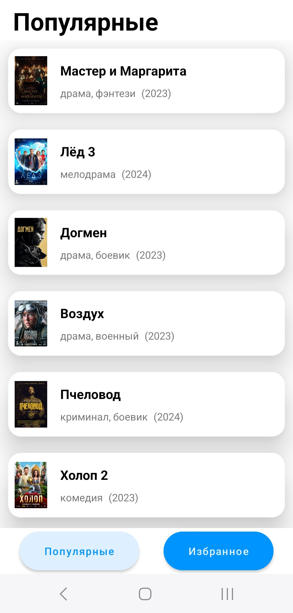
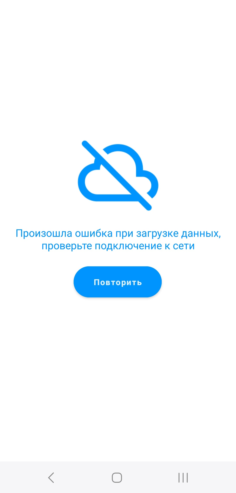

# Приложение "КиноКаталог"

Это приложение предоставляет пользователю список фильмов с информацией о названии, жанре и годе выпуска.

## Функциональность

- Просмотр списка фильмов: Пользователь может просматривать список фильмов, доступных в каталоге.
- Подробная информация о фильме: Пользователь может просматривать подробную информацию о каждом фильме, включая его название, жанр и год выпуска.
- Уведомление об ошибках: При возникновении ошибки загрузки данных или взаимодействия с приложением пользователю будет показано уведомление.

## Технологии

- Язык программирования: Java

## Установка и запуск

1. Клонируйте репозиторий на ваш компьютер.
2. Откройте проект в Android Studio.
3. Убедитесь, что у вас установлен Android SDK и все необходимые зависимости.
4. Запустите приложение на эмуляторе или реальном устройстве.

## Скриншоты

   